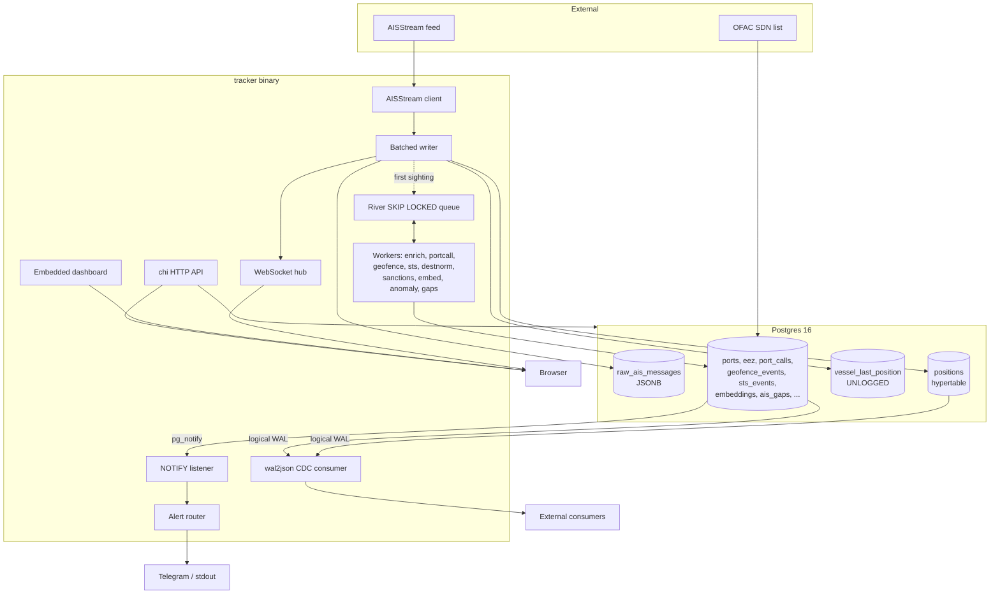
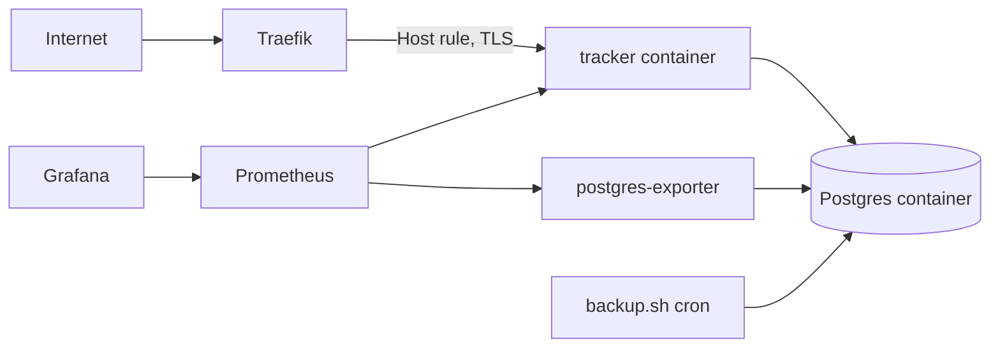

# Architecture

ais-tracker is one Go binary and one Postgres database. The binary ingests live
AIS traffic, runs the analytics as background jobs, and serves an HTTP + WebSocket
API with an embedded dashboard. Postgres does the heavy lifting: storage,
spatial math, search, vectors, queuing, pub/sub, and change capture all live in
the same instance.

## System overview

## Data flow

**Ingest.** The AISStream client holds a WebSocket to the upstream feed and
pushes decoded messages onto a bounded channel. When the channel fills the
client drops messages rather than stalling the socket, so a slow database never
backs pressure onto the network read. The writer batches messages and flushes on
size or interval, whichever comes first. Each flush writes the raw JSONB, appends
position reports to the TimescaleDB hypertable, upserts the vessel row and the
UNLOGGED last-position cache, and hands the batch's fixes to the WebSocket hub.
The first time an MMSI is seen, the writer enqueues an enrichment job.

**Background analytics.** Everything that does not belong on the hot ingest path
runs as a periodic job on the River queue, which is `SELECT ... FOR UPDATE SKIP
LOCKED` over a Postgres table. Each worker is a single query reconciled
idempotently into its own table: port-call detection, geofence evaluation,
ship-to-ship transfer detection, destination normalization, sanctions matching,
trajectory embedding, anomaly scoring, and AIS-gap detection. A periodic
scheduler enqueues them; the pool drains them with no double-processing.

**Real time.** Triggers call `pg_notify` when a geofence is crossed, a vessel
goes dark, or an emergency squawk arrives. A dedicated listener connection
receives those notifications and a router fans them out to dispatch adapters
(stdout, Telegram) with retry and a dead-letter table. In parallel, a wal2json
logical-replication slot streams inserts and updates on the high-signal tables to
external consumers, which is durable and replayable where NOTIFY is neither.

**Serving.** The chi router exposes REST endpoints for search, vessel detail,
tracks, ports, geofences, and the alert feeds. The WebSocket hub pushes live
positions filtered to each client's map viewport. The dashboard is static HTML,
CSS, and JavaScript embedded in the binary with `go:embed` and served from the
same port.

## Concurrency model

`run()` builds a set of long-lived components and supervises them under an
`errgroup`. A failure in any component cancels the rest; a shutdown signal gives
them a bounded grace window to drain before the process forces exit. The
components are the ingest client, the writer, the rate and dedup housekeepers,
the job queue, the NOTIFY listener, the alert router, the CDC consumer (when
logical replication is available), and the HTTP server.

The one connection that is deliberately not pooled is the NOTIFY listener: a
`LISTEN` registration lives on a specific backend, so a pooled connection would
lose its subscriptions the moment the pool recycled it. The listener holds its
own `pgx.Conn` and reconnects with backoff. The CDC consumer likewise runs on a
replication-mode connection of its own.

## Deployment topology

The production stack (`deploy/docker-compose.prod.yml`) is Postgres, a one-shot
migrator, the tracker, and a Postgres metrics exporter. Traefik terminates TLS
and routes by host to the tracker's single port. The tracker image is a
distroless static build of about 15 MB; the dashboard ships inside it, so there
is no separate frontend service and no CDN to manage beyond the map tiles the
browser loads. Prometheus scrapes `/metrics` on the tracker and the exporter;
`backup.sh` runs `pg_dump` on a schedule. See
[postgres-capabilities.md](postgres-capabilities.md) for what each Postgres
feature does and [replication.md](replication.md) for the CDC slot runbook.
