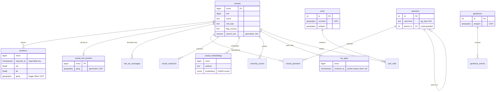

# Schema

The full schema lives in `migrations/` as ordered golang-migrate files
(`000001`–`000024`). River owns and versions its own `river_job` tables through
its migrator, so those are not in this set. This page is the map and the
commentary on the non-obvious choices; the migrations are the source of truth.

## Entity relationships

## Non-obvious choices

**`positions.geog` is filled by a trigger, not `GENERATED`.** A compressed
TimescaleDB hypertable rejects generated columns, so the geography is populated
by a `BEFORE INSERT` trigger. COPY fires row triggers, so the batched writer
keeps its fast path. The plain `vessel_last_position` cache has no such
restriction and uses a real `GENERATED ... STORED` column.

**Geography, not geometry.** Every spatial column is `geography(..., 4326)` so
distance and radius operations return metres on the globe by default. Vessels
cross oceans; degrees on a plane would be wrong. Planar operations cast to
`::geometry` at the call site.

**`vessel_last_position` is UNLOGGED and separate from `positions`.** The cache
is the hot "where is it now" table, written on every flush and rebuilt from the
archive on startup. Keeping it out of the WAL removes replication and fsync cost
from the write path. The hypertable keeps the durable history.

**`ais_gaps` has a partial unique index.** `UNIQUE (mmsi) WHERE resolved_at IS
NULL` enforces at most one open gap per vessel while allowing any number of
resolved ones. The invariant lives in the schema rather than in worker code.

**`operators.parent_id` is guarded by a trigger.** The ownership tree is walked
with recursive CTEs, so a cycle would be a query that never terminates. A trigger
rejects any update that would introduce one, and the CTEs carry a depth bound as
a second guard.

**`vessel_embeddings` fixes the vector at 64 dimensions across methods.** One
`vector(64)` column and one HNSW index serve every embedding method; only
same-method vectors are ever compared. Adding a method is a new string, not a
schema change. See [embeddings.md](embeddings.md).

**`search_doc` uses the `simple` dictionary.** Vessel names are multilingual
proper nouns, so stemming and English stop-words would hurt more than help. The
`simple` config tokenises and lowercases without linguistic processing, and the
two-argument `to_tsvector` form is IMMUTABLE, which a generated column requires.

## Migrations

Every migration has an `up` and a `down`; the test suite applies all of them up
and then all the way back down against a real Postgres, so the `down` path is not
allowed to rot. Reference data (ports, EEZs, the OFAC feed) is loaded by
idempotent one-shot commands under `cmd/`, not by migrations, so the schema and
the data it holds version independently.
